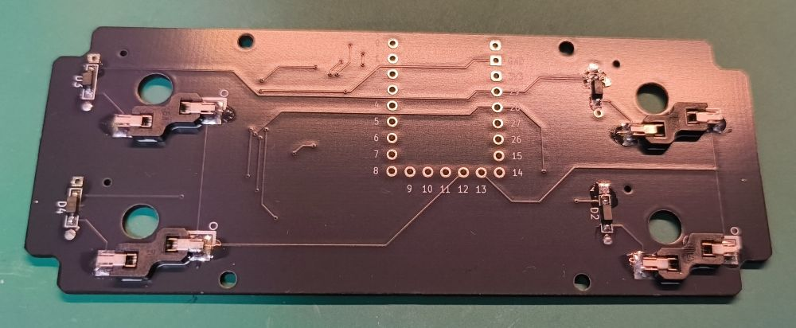
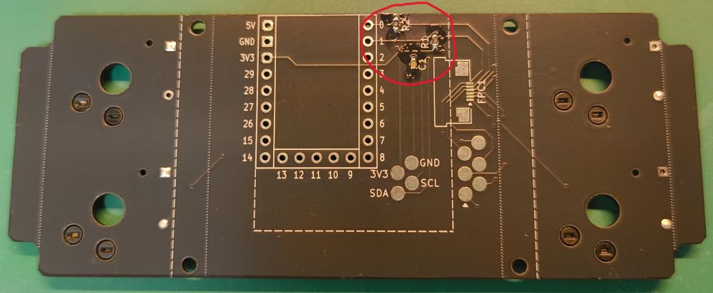
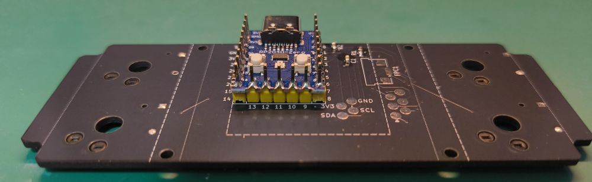
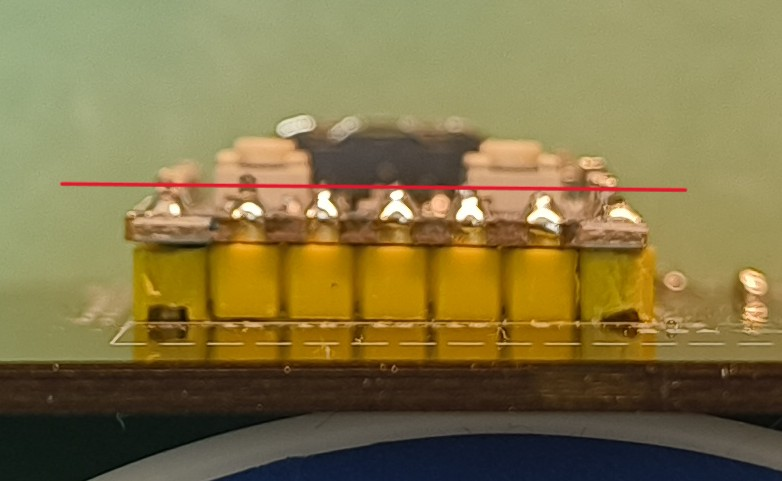

# tps43-ek
Experiment kit of Azoteq TPS43 for study in advance of designing Girasole40.

## Parts List (WIP)
(In study)

### Parts need to be prepared/purchased
|Part|Quantity|Where I bought it|Remarks|
|---|---|---|---|
|Wired controller board|1|AliExpress|RP2040-Zero (w/ pin headers)|
|Choc socket|4|yushakobo|e.g. Kailh PG1350 KeySwitches Contact (CPG135001S30)|
|Choc V2 switch|4|AliExpress|-|
|Keycap|4|AliExpress|-|
|Touchpad Module TPS43|1|MOUSER|-|
|Acrylic Board for touchpad (2mm thickness)|1|Amazon|Need to be cut to suit TPS43|
|M2 Spacer (5.0mm)|8|yushakobo|-|
|M2 screw (3.5mm)|16|yushakobo|-|
|FPC cable (6pin, 0.5mm pitch, 30mm length)|1|Amazon|T.B.D|
|Diode|4|MOUSER|1N4148W|
|Resister 1608 1Kohm|2|akizukidenshi|-|
|Capaciter 1608 10uF|1|akizukidenshi|-|
|FPC socket (6pin, 0.5mm pitch)|1|Amazon|-|
|Rubber feet|5|Amazon|-|

### Parts need to be ordered/printed
|Part|Quantity|Remarks|
|---|---|---|
|Touchpad mount plate|1|<image src="images/TouchpadMountPlate.png" height="100px"/> gerber/gerber-touchpad.zip|
|Top plate|1|<image src="images/TopPlate.png" height="100px"/> gerber/gerber-top.zip|
|Main plate|1|<image src="images/MainPlate.png" height="100px"/> gerber/gerber.zip|
|Bottom plate|1|<image src="images/BottomPlate.png" height="100px"/> gerber/gerber-bottom.zip|

## Build Guide (WIP)
### Assemble the touchpad
Cut acrylic board to suit TPS43.

Put double-sided tape on the acrylic board.

Put the acrylic board onto TPS43.

Put double-sided tape on inside on dashed line of the Touchpad mount plate.

Then, put it onto TPS43.

### Assemble passive components on main plate
#### Back side
Solder diodes then switch sockets on back side of the main plate.

#### Front side
Solder resisters and a capacitor on front side of the main plate.

And, solder FPC socket on the main plate. (T.B.D.)

#### RP2040-Zero
Solder RP2040-Zero on the main plate using pin headers.

Then cutoff the pins on Front side using nipper.

### Assemble plates
Put top plate on the main plate. Then put keyboard switches.

TODO: FPC Cable Connection

Put the touchpad plate on main plate using spacers and screws.

Put the plates on bottom plate using spacers and screws. And put keycaps.

Finally, put rubber feets on the bottom plate.

